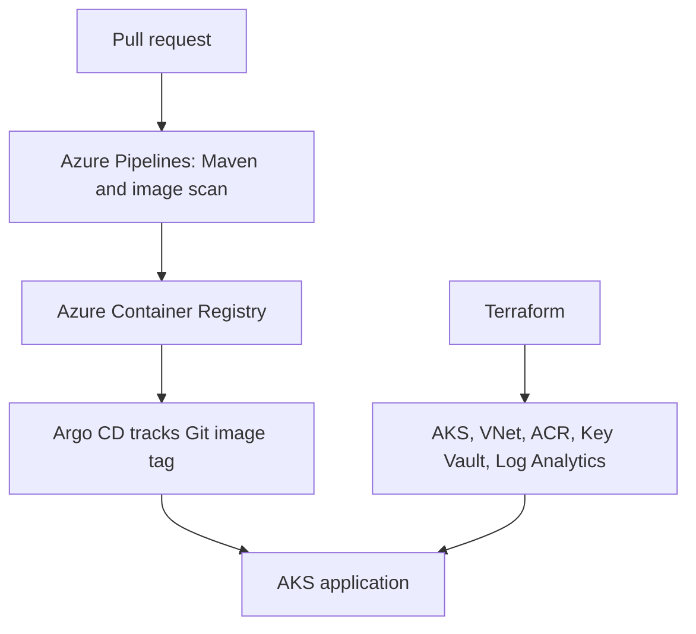

# Azure platform showcase — phase 1

This extends the existing **Java WAR → Jenkins → Azure VM → Ansible** lab with a separate container delivery path. It is a portfolio **implementation draft**, not evidence of a live AKS deployment. Keep the VM lab intact while verifying the new path.

## What this path demonstrates

The application is the existing `app/` Java servlet. Its health endpoint is `/devops-e2e-app/hello`. The new Dockerfile runs the built WAR on Tomcat 9, which matches the `javax.servlet` API in the POM.

## Files

| Path | Purpose | Current state |
|---|---|---|
| `Dockerfile` | WAR in Tomcat 9 runtime | Draft; requires Docker build |
| `azure-pipelines.yml` | PR test, image build/scan; main branch push to ACR | Draft; requires service connection and ACR |
| `terraform/` | Azure RG, VNet, AKS, ACR, Key Vault, Log Analytics | Draft; requires backend and subscription |
| `helm/app/` | Deployment and ClusterIP service with probes | Draft; requires Helm and cluster |
| `argocd/application.yaml` | GitOps application, manual sync | Draft; requires Argo CD |
| `docs/video-script.md` | Screen-by-screen recruiter walkthrough | Ready to rehearse; record only real runs |
| `docs/evidence-checklist.md` | Proof and privacy checklist | Fill after runs |

## Setup order

1. Create an Azure Storage Account/container **outside this Terraform configuration** for remote state. Configure Azure RBAC for the operator; copy `terraform/backend.hcl.example` to an ignored `backend.hcl`. Never commit credentials or state.
2. Locally run `mvn -f app/pom.xml clean verify`, then `docker build -f platform/Dockerfile -t devops-e2e-app:local .`, then test `http://localhost:8080/devops-e2e-app/hello` after starting the image.
3. Run `terraform -chdir=platform/terraform init -backend-config=backend.hcl`, then `fmt -check`, `validate`, and `plan`. Review cost, quota, names, and region before an explicit `apply`.
4. Set up an Azure DevOps ARM service connection using workload identity federation. Grant its identity `AcrPush` on the created registry. Edit pipeline variables `azureServiceConnection` and `acrName` to match your resources. Configure the pipeline to use this GitHub repository and grant it access to the service connection.
5. Merge validated CI changes. The pipeline pushes a commit tagged image to ACR only on `main`; copy the **exact tag** into `helm/app/values.yaml` via a PR. Do not use `latest`.
6. Install Argo CD in the cluster separately. Change its manifest `repoURL` if the repository moves, apply it, then sync and inspect the application. The draft uses **manual sync** to make the first demonstration controlled.
7. Collect the exact PR, pipeline run, image digest, Terraform plan, Argo status, pod events, response, and rollback evidence in `docs/evidence-checklist.md` before describing any part as deployed.

The image pipeline triggers only on app, Dockerfile, and pipeline edits. After changing Helm values, run `helm lint platform/helm/app` and `helm template devops-e2e-app platform/helm/app` as a separate chart check; a tag-only PR should not rebuild the image and create another tag.

## Engineering decisions

- ACR is private; AKS kubelet gets `AcrPull`. The pipeline identity needs `AcrPush` and uses Azure federation instead of a stored client secret. The AKS control plane has a user assigned identity with subnet rights.
- Key Vault has RBAC enabled but the demo app has no secrets to fetch yet. Claim secrets integration only after wiring and testing a workload identity.
- Azure Monitor container logs go to Log Analytics through the AKS monitoring add-on. Prometheus/Grafana are future work, not represented as installed.
- The AKS API and VM nodes are configured for a **lab**. Before describing a production deployment, add private networking, ingress/TLS, policies, budget, backup and a stricter threat model.
- With Argo CD reconciling the release, roll back by reverting the Git tag and syncing. A direct `kubectl rollout undo` can be overwritten by GitOps.

## Next measurable milestone

Get a PR green with Maven and Trivy, then show an actual immutable image in ACR. Only then provision the cluster and record the GitOps/incident section. Provisioning AKS and Log Analytics costs money while they exist; destroy lab resources when finished.
